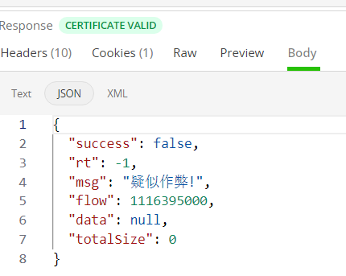
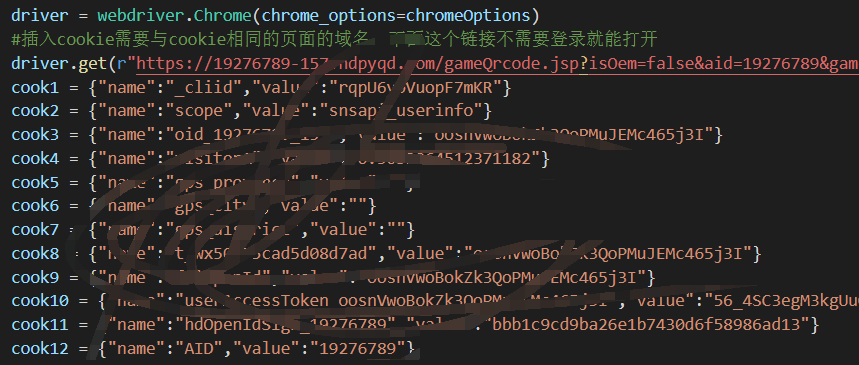
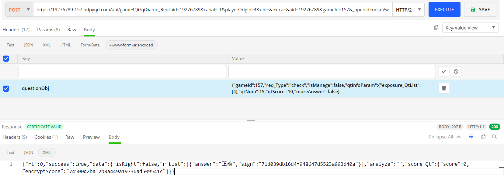
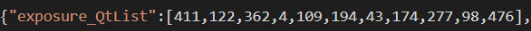
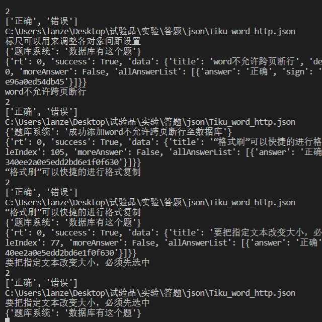
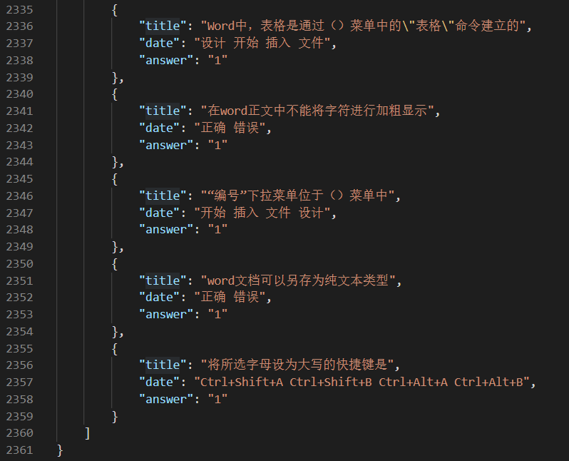
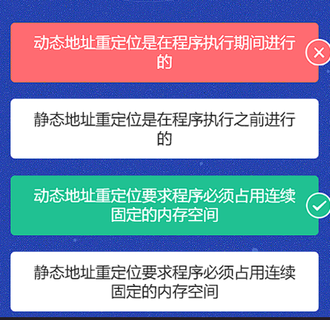
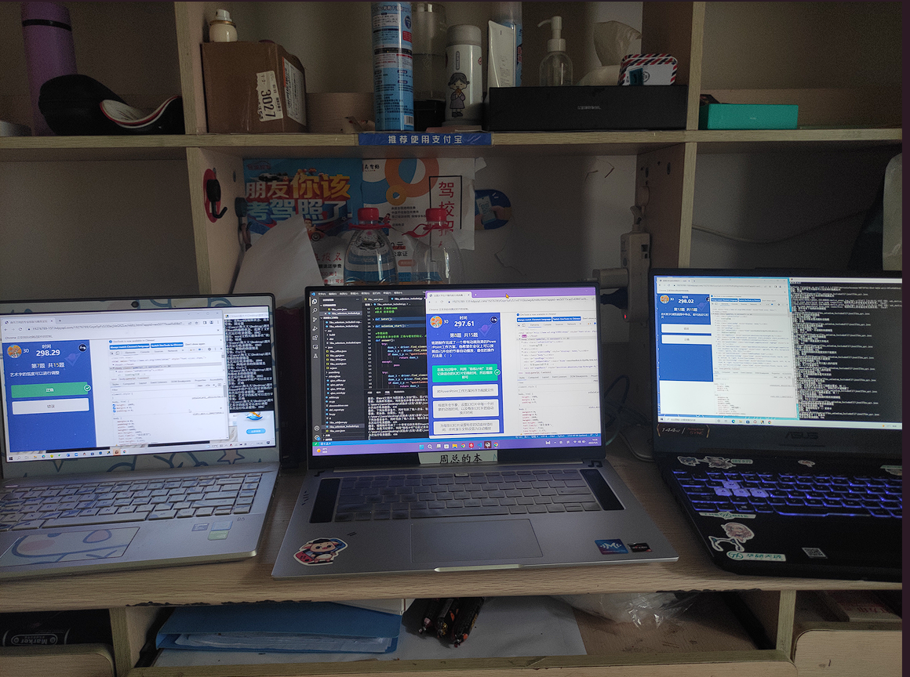

# 自动化答题+补充题库
项目对应的比赛  
["挑战杯" 全国大学生信息化素养技能大赛](http://qbz.kingchannels.com/#/frontPage/worldReadingActive)

下面是一些碎碎念念 
直接跳往使用文档 
[使用文档](./%E4%BD%BF%E7%94%A8%E4%BB%8B%E7%BB%8D.md)

## 起因
大学生嘛，多参加参加下比赛，混口学分  
在导员的推荐下认识了此活动

以为是跟平常一样，水水活动完事 <be/>
但是阅读活动须知后，凭着对这方面的直觉，一眼就能看出这活动能作弊 <be/>

并且在脑内有个大纲，可惜距离活动开始还有一个月时间 <be/>

等到了活动开始日期后，又因为种种事情耽搁，此事就这样推延到了五一放假的最后一天(5月4日)

大清早没事可做，就想起了有这么一个活动，打开研究研究，答题逻辑比我想象的还要简单，给自己正式创立了一个  夺冠计划  此时距离比赛结束只有5天,5月10日00:00(结束)

刚好现在又是上学期间，索性直接请假，期间5月5日导员不知道啥事耽搁了，5月6日才把假给我批了  
此时距离比赛结束只有3天，开始全力冲刺

# 开始
首先分析答题思路  
进入主办方的线上平台进行答题，15道题保证全对并且要比其他人用时最低

查看一下排行榜  
  
最快 14.61秒 且第一名与第二名相差 1.2秒  
最快的选手平均一道题花费0.974秒，感觉像是人工操作的，也不排除也是使用程序

我自己上手体验一把 150分 花费134秒😂  
题相对简单，但容易出现手抖的情况，况且主办方还需要乱调位置  
比如：位置突变  
>正确 错误   正确 错误   错误 正确   正确 错误   

就很容易选错，更何况还是比速度，简直就是小母牛用树枝摩地，太折磨了  

## 研究
主办方的线上平台只能通过微信进入，使用其他方式均无法打开  
但是这个线上平台使用的web服务也就是网页，并非小程序  
也就可以抓取网络包来分析  
题全部使用的动态API，实时获取嘛  
发现 成绩提交数据的包，可以无限复刻，但是无法修改其中的数据。  
分数，所花时间均使用加密，一但修改再次提交，就提示你作弊了😂😂   

  

换个思路  
既然是网页就可以用浏览器打开，再让浏览器自动化就行了  
思路定下，开始实施  
浏览器打开会提示请在微信打开，无法成功进入答题页面   
使用抓网络包，看看在微信打开跟浏览器打开有什么不同  
>UA，Cookie  

给浏览器载入微信同款 UA，Cookie  
成功进入活动页面

期间遇坑，Cookie不能像其他平台一样 一次性全部载入  
必须要一个参数一个参数的依次载入  
这玩意卡我半天 [哭]  

  

答题环境复刻出来了，现在考虑的是如何答题  
通过,selenium 可获取到 题目，与四个答案选项，但是该如何获取到正确答案？  

### 方案一：
通过API接口获取答案  
网络包分析   
每次答题都会请求一个API进行答案验证，并给出正确答案  

  

> 问题：题目在数据包中 使用的是一个列表代替

  

通过题目、源代码分析均无法得知 题目对应的列表是什么  
此通过API接口获取答案方案废弃 

### 方案二：
创建一个数据库充当题库  
每道题都从数据库里去寻找，然后回答  

刚开始的时候就发现题是通过API调动获取  
这样就可以通过手动复刻API调动获取题库

由于调用的题库有时会获得重复的题目，所以就大量调用，并排除重复项
2000次调用总共获取非重复题 483道题 用时500秒  
效率很高哇👍  

>问题：只有题没有答案

2358行。。。  
一道题一道题的做吧，半小时 做了 36道题  且不保证是否正确  
我最讨厌刷题了，我在内心告诉自己再做下去人会麻的，会跟河边杀了30年的鱼的渔夫一样麻  
无奈  
此方案放弃 |  想要原题的同学可以找到我😂 都是市面上的真题 考计算机二级的  

### 方案三：
平台上每次答题都会返回一个正错误提示  

  

基于这点可以让程序自主做题并收集题目与答案 并收录到数据库中  

深研发现 每次在提示正确或错误时会在选项本身上出现一层div嵌套，出现div嵌套的有正确选项与错误选项，再对比正确选项与错误选项的不同之处
获取正确选项的定位  
>逻辑清晰，代码实现  
速度太慢，量来凑  

# 后话
官方也没说不能用这玩意呀😊

[使用文档](./%E4%BD%BF%E7%94%A8%E4%BB%8B%E7%BB%8D.md)